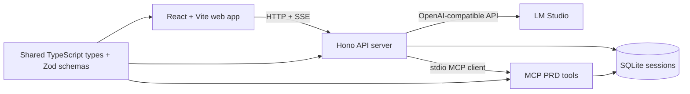

# PRD Assist

PRD Assist is a local-first product requirements assistant: a chat workspace where an AI agent interviews you, turns the conversation into a structured PRD, and keeps the document visible as it evolves.

The project is built as a TypeScript monorepo with a React app, a Hono backend, a SQLite session store, and an MCP server that exposes deterministic PRD-editing tools. The current prototype has moved beyond a single chat agent into a routed turn pipeline with orchestration, planning, worker, interviewer, verifier, and summary stages.

## What It Does

- Runs a two-pane product workspace: conversation on one side, live PRD on the other.
- Stores each session locally in SQLite.
- Maintains a fixed seven-section PRD: vision, problem, target users, goals, core features, out of scope, and open questions.
- Streams agent thinking and final responses over Server-Sent Events.
- Uses MCP tools to read and update PRD sections through a controlled tool boundary.
- Supports role-specific local model configuration through LM Studio's OpenAI-compatible API.

## Architecture



The backend owns the turn loop. For each user message it:

1. Locks the session so concurrent turns do not collide.
2. Persists the user message and derives a title when needed.
3. Classifies whether the turn needs PRD work.
4. Routes into either an interview-only response or the planner/worker/verify path.
5. Streams thinking events and a final response back to the browser.
6. Regenerates the PRD summary when the PRD changed.

## Workspace Layout

```text
apps/
  web/      React, Vite, Tailwind, browser routes, SSE client
  server/   Hono API, turn orchestration, LM Studio client, SQLite store
  mcp/      stdio MCP server exposing PRD tools
packages/
  shared/   PRD types, section keys, and Zod schemas
scripts/    repository checks and doc tooling
.docs/      planning notes, specs, investigations, and active work artifacts
```

## PRD Tool Surface

The MCP server exposes four tools:

- `get_prd` reads the full PRD for a session.
- `update_section` writes one PRD section.
- `list_empty_sections` reports sections that still need input.
- `mark_confirmed` marks a reviewed section complete after explicit user confirmation.

That small tool surface is intentional. The agent can reason freely, but durable PRD edits go through narrow, typed operations.

## Tech Stack

- Node 20+
- pnpm workspaces + Turbo
- TypeScript + Vitest + ESLint + Prettier
- React 18 + Vite + Tailwind
- Hono API server
- SQLite via `better-sqlite3`
- MCP SDK over stdio
- LM Studio through the OpenAI-compatible API

## Getting Started

Install dependencies:

```sh
pnpm install
```

Start LM Studio with an OpenAI-compatible server on:

```text
http://localhost:1234/v1
```

Run the app:

```sh
pnpm dev
```

By default:

- The server listens on `127.0.0.1:5174`.
- Vite serves the web app and proxies `/api` to the server.
- SQLite data is stored at `./data/prd-assist.sqlite`.

Open the Vite URL from the terminal output, create a session, and start describing the product you want to shape.

## Configuration

Useful environment variables:

| Variable                    | Purpose                                               | Default                           |
| --------------------------- | ----------------------------------------------------- | --------------------------------- |
| `SQLITE_PATH`               | SQLite database file used by the server and MCP child | `./data/prd-assist.sqlite`        |
| `LM_STUDIO_BASE_URL`        | OpenAI-compatible LM Studio endpoint                  | `http://localhost:1234/v1`        |
| `LM_STUDIO_MODELS_OVERRIDE` | JSON object for per-role model overrides              | built-in Gemma role defaults      |
| `MCP_COMMAND`               | Override MCP child process command                    | resolved workspace MCP entrypoint |
| `MCP_ARGS`                  | Override MCP child process arguments                  | `node --import tsx/esm ...`       |

Example model override:

```sh
LM_STUDIO_MODELS_OVERRIDE='{
  "orchestrator": { "model": "google/gemma-4-e4b" },
  "plannerBig": { "model": "google/gemma-4-26b-a4b", "maxIterations": 12 },
  "worker": { "model": "google/gemma-4-e4b" }
}' pnpm dev
```

## Scripts

```sh
pnpm dev             # run server + web app through Turbo
pnpm build           # type-check package builds
pnpm typecheck       # workspace type checks plus root tsconfig
pnpm test            # Vitest suites across packages
pnpm lint            # ESLint across packages and scripts
pnpm format:check    # Prettier check
pnpm doc-edit-check  # documentation edit guard
```

## Project Status

This is an active prototype. The core local architecture is in place: web UI, HTTP API, session persistence, MCP tools, shared schemas, and the routed multi-agent turn pipeline.

Known current rough edges:

- The normal dev entrypoint may hit local file-watch limits on some machines.
- Lint currently reports existing size/complexity issues in the multi-agent server path.
- A live PRD-generating turn requires LM Studio running with compatible local models.

## Why This Exists

Most PRD tools either start from a blank document or turn into a heavyweight project-management surface too early. PRD Assist keeps the first loop small: talk through the product, let the assistant ask useful questions, and watch the requirements document become real section by section.

The design goal is not an autonomous agent swarm. It is a controlled product-shaping loop where the user stays in the conversation, the PRD remains inspectable, and every durable edit passes through explicit tools.
